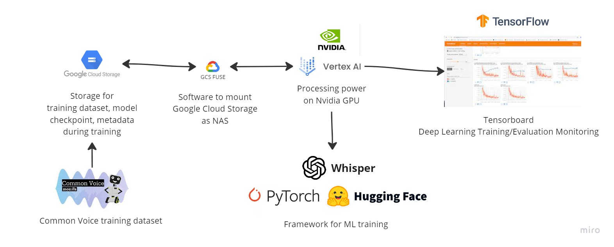

# Project Architecture and Access to Production
The `set-speechtotext-poc` project is a proof of concept for speech-to-text conversion using machine learning models.

## Architecture Details

- Provider: GCP (Google Cloud Platform)
- Technology: Python, TensorFlow/PyTorch, Jupyter Notebooks

## Implementation Notes

1. The data preprocessing pipeline may need the most attention, as it's crucial for model performance.
2. The project may face scalability issues if the input data size increases significantly.
3. Known limitations include potential model accuracy variations based on audio quality and accents.

## Dev Architecture


### Main components:

1. Data Preprocessing Pipeline
2. Model Training Module
3. Evaluation Notebooks

## Virtual Machines

- VM-1: Hosts Jupyter Notebooks for development and experimentation
- VM-2: Used for data preprocessing and model training

## Datasets
### Speech Dataset

- Description: Raw audio files for speech-to-text conversion
- File Location: GCS Uri: gs://set-speechtotext-poc-dev/raw-audio
- Retention Policy: 6 months

## Tokens and Accounts
### Dev GCP Service Account

- Location: Bitwarden GCP Collection
- Person in charge: [tm-zoon](mailto:zoon_p@thinkingmachin.es)
- Validity: 1 year
- Description: This service account is used to access GCP resources for development
### How to Refresh:

1. Go to GCP Console
2. Navigate to IAM & Admin > Service Accounts
3. Rotate keys for the dev service account


## Production Architecture

1. Optimized Data Preprocessing Pipeline
2. Deployed Speech-to-Text Model
3. API for Speech Recognition Requests

## Virtual Machines

- VM-Prod-1: Hosts the production speech-to-text model
- VM-Prod-2: Handles API requests and preprocessing

## Datasets
### Processed Speech Dataset

1. Description: Preprocessed audio data ready for model inference
2. File Location: GCS Uri: [here](gs://set-speechtotext-poc-prod/processed-audio)
3. Retention Policy: 1 year

## Tokens and Accounts
### Prod GCP Service Account

- Location: Bitwarden GCP Collection
- Person in charge: [Operations Manager](ops@email.com)
- Validity: 6 months
- Description: This service account is used to access GCP resources in production
### How to Refresh:

1. Go to GCP Console
2. Navigate to IAM & Admin > Service Accounts
3. Rotate keys for the prod service account

## Accessing Cloud Platform Environments
### Get access to GCP Platform

- Person in charge: [DevOps Lead]
- Bitwarden Credentials: [Link to Bitwarden entry]


1. Install Google Cloud SDK
2. Run gcloud auth login and follow prompts

## Accessing Prod VM

1. Update your ssh config to have the following:

```bash
Host set-speechtotext-vpn
   Hostname [VPN_IP_ADDRESS]
   User [VPN_USERNAME]

Host prod-speechtotext-app
   Hostname [PRIVATE_IP]
   User [VM_USERNAME]
   ProxyJump set-speechtotext-vpn
```

2. Run `ssh prod-speechtotext-app`

### Access Prod App in UI

1. Install `sshuttle`
2. Run `sshuttle -r prod-speechtotext-app [VPC_CIDR_RANGE]`
3. Open web browser using the Private IP found in your SSH config (`http:[PRIVATE_IP]:8080`)
